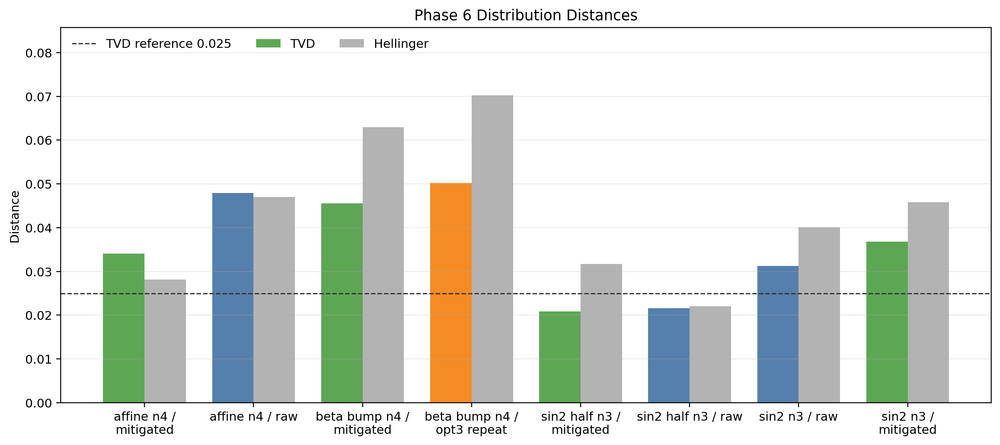
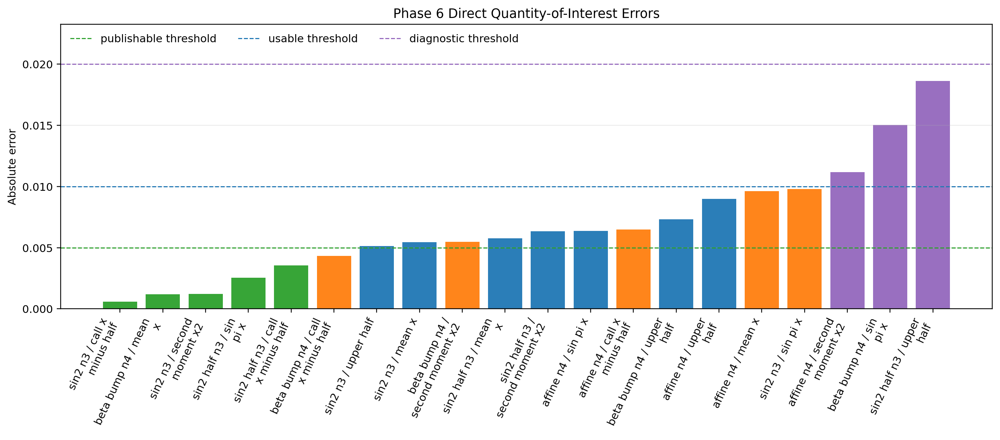
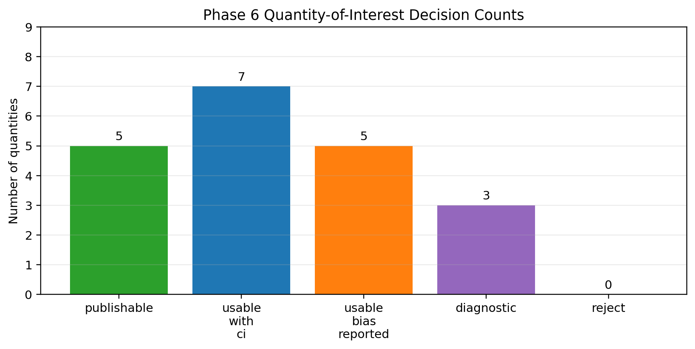
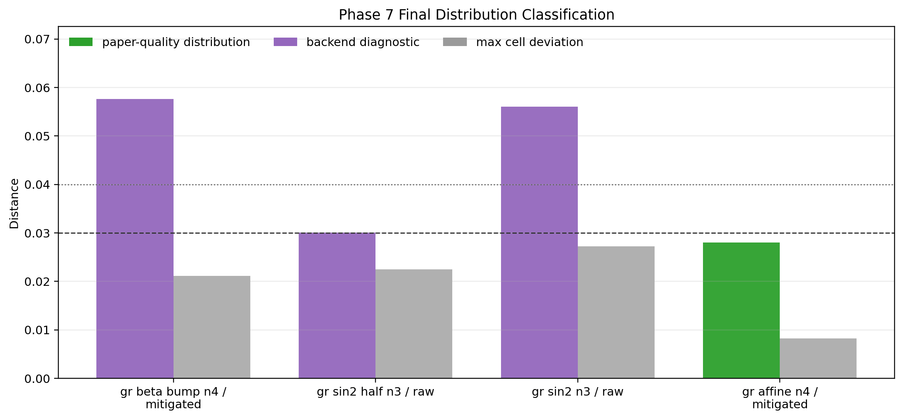
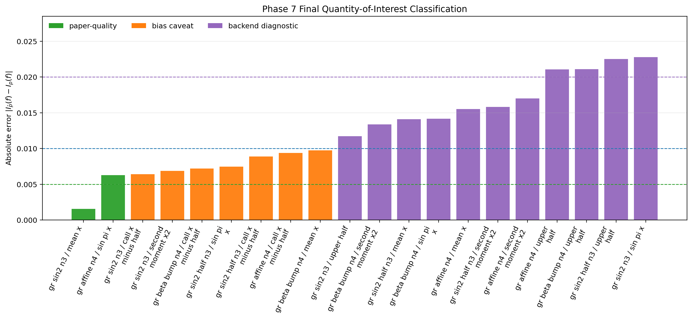
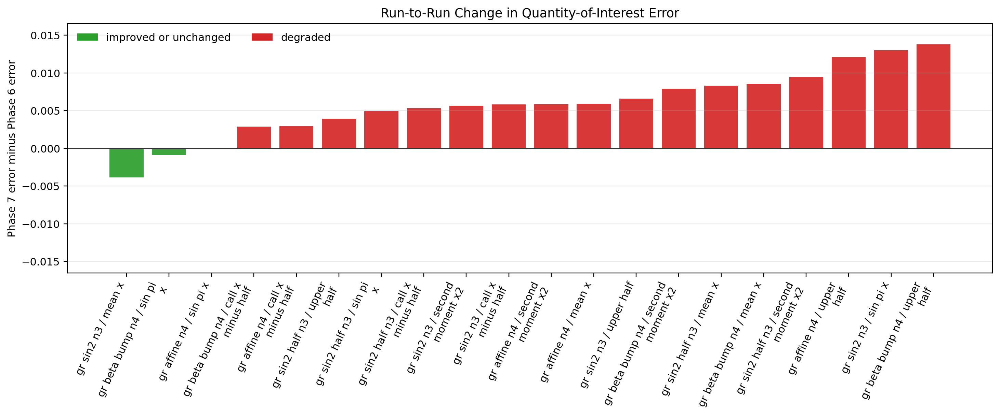
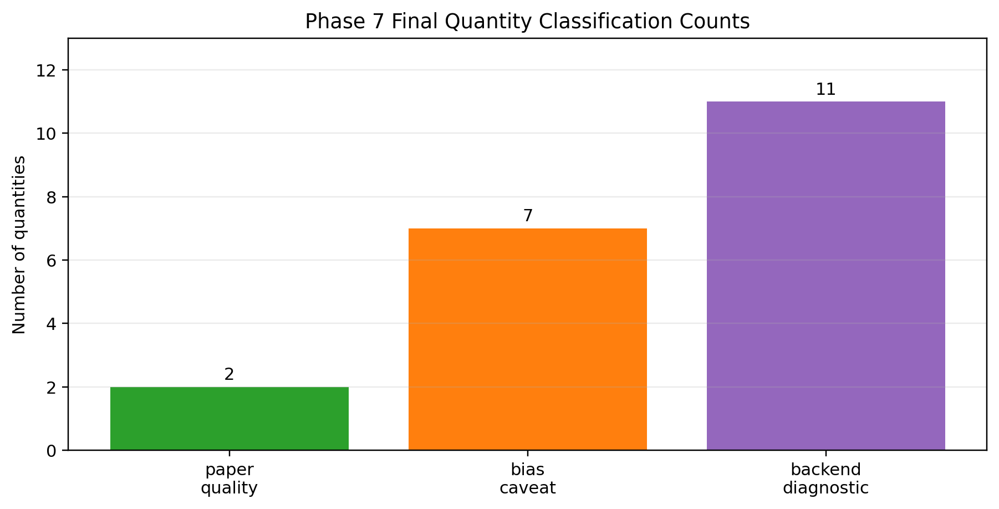
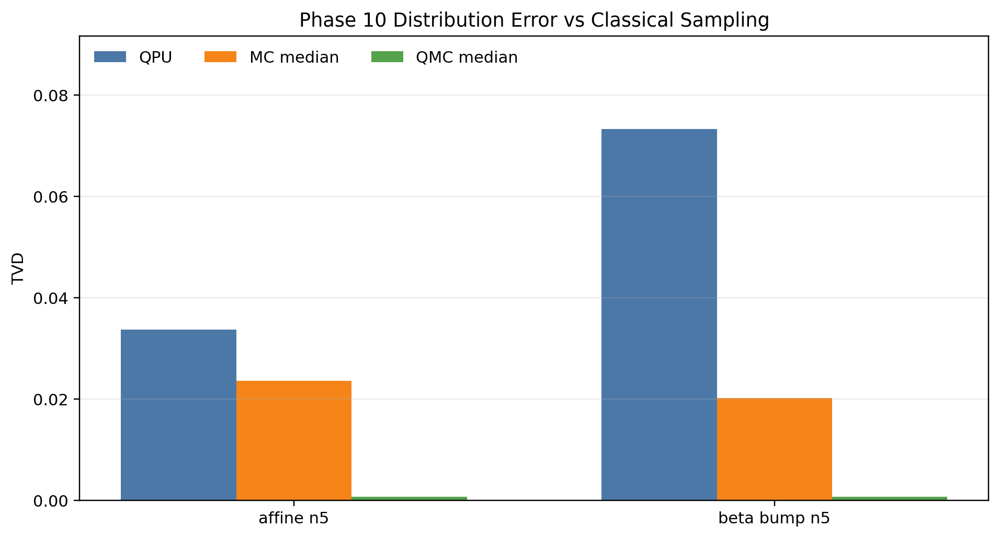
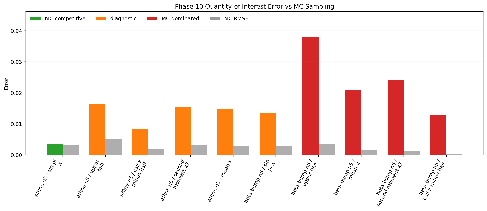

# Grover-Rudolph QAE Benchmark

Software and experimental workflows for benchmarking Grover-Rudolph quantum
state preparation and amplitude-estimation-based numerical integration on IBM
Quantum hardware.

This repository supports the IBM Quantum Credits project:

> Benchmarking Grover-Rudolph quantum state preparation for utility-scale
> numerical integration on IBM quantum hardware

## Goals

- Generate structured Grover-Rudolph state-preparation circuits.
- Compare MLAE, IQAE, standard QAE, Monte Carlo, and quasi-Monte Carlo baselines.
- Record Benchpress-style compilation metrics: construction time, transpilation
  time, depth, two-qubit depth, two-qubit gate count, SWAP count, layout, and
  estimated circuit duration.
- Track structural metrics for the encoding oracle: multilinear support, maximum
  degree, embedding stratum \(m_1\), and weighted canonical length
  \(L_{\mathrm{can}}\).
- Run selected instances on IBM Quantum backends and evaluate error mitigation
  and postselection strategies.

## Repository Layout

```text
grover-rudolph-qae-benchmark/
├── docs/              # Design notes and experimental protocols
├── experiments/       # Reproducible experiment configurations and scripts
├── notebooks/         # Exploratory notebooks
├── results/           # Derived analyses (ignored by Git) and results/hardware/
│                      # raw QPU readouts (published)
├── src/               # Python package source
└── tests/             # Unit and regression tests
```

## Current Status

The experimental campaign is complete. Eighteen phases were executed against the
IBM Quantum Credits award of 180 minutes of Qiskit Runtime, on `ibm_fez`,
`ibm_kingston` and `ibm_aachen`, covering dyadic grids from 4 to 64 points,
together with local simulator audits, error mitigation and classical MC/QMC
baselines. The consolidated write-up is `doc_tex/main_v1.pdf`.

## Version History and Provenance

**This repository was published to GitHub after the experimental campaign had
already been carried out. The first commit therefore contains all eighteen
phases at once, and there is no commit-by-commit record of how the code evolved
while the experiments were being run.**

We state this explicitly because the repository is cited as reproducible
evidence, and a reader is entitled to know what the version history does and
does not prove. The audit trail for the campaign does not live in Git; it lives
in the artifacts themselves:

- `docs/` holds the protocol written *before* each phase was submitted and, for
  several phases, the readout written after. The protocols record the
  pre-declared acceptance thresholds, which is what makes the promote/reject
  decisions meaningful rather than retrospective.
- `experiments/` holds the exact JSON configuration submitted for each phase.
- `results/hardware/` holds one timestamped directory per run (for example
  `phase15_gaussian_sigma025_n6_distribution_ibm_kingston/20260809T115457Z/`),
  each containing the prepared campaign, the transpiled circuits, and the
  fetched results with the **IBM job identifier**, the backend name, the backend
  calibration status and the raw measurement counts. Those job identifiers are
  the primary record: they are assigned by IBM Quantum at submission time and
  cannot be reconstructed after the fact.
- `doc_tex/` reports every phase in the order it happened, including the phases
  that failed and the circuits that were rejected before submission.

From this first commit onwards, changes are tracked in the usual way and the Git
history is authoritative.

## Grover-Rudolph Case Names

Names of the form `gr_<profile>_n<n>` denote finite probability laws on a
dyadic midpoint grid with `n` qubits and \(N=2^n\) cells:

\[
x_i = \frac{i+1/2}{N}, \qquad i=0,\ldots,N-1.
\]

A nonnegative profile \(F\) is sampled on this grid and normalized as

\[
p_i = \frac{F(x_i)}{\sum_j F(x_j)}.
\]

The Grover-Rudolph circuit prepares

\[
\sum_i \sqrt{p_i}\,|i\rangle,
\]

so measuring in the computational basis should reproduce the discrete
probability law \(p\). The larger-grid cases currently used are:

```text
gr_sin2_half_n3: n=3, N=8,  F(x)=sin^2(pi x / 2)
gr_sin2_n3:      n=3, N=8,  F(x)=sin^2(pi x)
gr_affine_n4:    n=4, N=16, F(x)=0.11 + 0.57 x
gr_beta_bump_n4: n=4, N=16, F(x)=x (1 - x)^4
```

For the amplified `gr_affine_n4` test, the marked event is the upper half of
the grid, \(x_i \ge 1/2\), whose exact probability is
\(a=0.6803797468\ldots\).

## IBM Runtime Usage

To check the Qiskit Runtime usage for the account configured in
`~/.qiskit/qiskit-ibm.json`, run:

```bash
python3 scripts/check_ibm_runtime_usage.py
```

By default, the script also reads `.env` from the repository root. Set
`IBM_QUANTUM_INSTANCE` there to avoid automatic instance selection warnings:

```bash
cp .env.example .env
```

Current project default:

```text
IBM_QUANTUM_INSTANCE=IBM_Quantum_Credits_Program
```

To query every visible instance:

```bash
python3 scripts/check_ibm_runtime_usage.py --all-instances
```

The script does not print the IBM Quantum API token.

To list available backends in the active instance:

```bash
python3 scripts/list_ibm_backends.py
```

To use a non-default IBM Quantum instance without editing `.env`, pass its CRN
explicitly:

```bash
python3 scripts/list_ibm_backends.py \
  --instance "crn:v1:bluemix:public:quantum-computing:us-east:a/630098c15bad42a399d914559e9c9753:f000fd17-3cf1-4766-a2ef-987f5576b97f::"
```

The extended-access instance checked on 2026-08-11 exposed:

```text
ibm_marrakesh
ibm_miami
ibm_boston
ibm_kingston
ibm_fez
ibm_pittsburgh
```

At that check, `ibm_boston` was the most attractive candidate by mean
two-qubit and readout error, while `ibm_marrakesh` had the smallest queue.
Backend selection should still be redone immediately before QPU submission,
because queue and calibration data are time-dependent.

For larger devices only:

```bash
python3 scripts/list_ibm_backends.py --min-qubits 100
```

## Angle-Structure Classification

The encoding-complexity reference defines the class `G_n^d` by the multilinear
degree of the QAE angle map

```text
Theta_g(b) = 2 asin(sqrt(g(x_i(b)))).
```

This is not the ordinary polynomial degree of `g(x)`. In particular, a profile
that is affine in `x` can have full angle degree after the nonlinear
`2 asin(sqrt(.))` transformation.

Verify the initial calibration hierarchy:

```bash
python3 scripts/classify_angle_structure.py \
  --builtins g0 g1 g2 \
  --num-qubits 2
```

Expected result:

```text
g0  -> G_2^0
g1  -> G_2^1
g2  -> G_2^2
```

Classify the larger Grover-Rudolph profiles when they are interpreted as QAE
amplitude functions:

```bash
python3 scripts/classify_angle_structure.py \
  --config experiments/phase0_gr_larger_grids_ibm_fez.json \
  --input-kind qae_function \
  --output-prefix phase0_gr_profile_angle_structure
```

Current profile classes:

```text
gr_sin2_half_n3 -> G_3^1
gr_sin2_n3      -> G_3^2
gr_affine_n4    -> G_4^4
gr_beta_bump_n4 -> G_4^4
```

For the Phase 9 scaling audit:

```bash
python3 scripts/classify_angle_structure.py \
  --config experiments/phase9_integration_scaling_audit.json \
  --input-kind qae_function \
  --output-prefix phase9_profile_angle_structure
```

Classify the direct-integration test functions used as quantities of interest:

```bash
python3 scripts/classify_angle_structure.py \
  --quantities upper_half mean_x second_moment_x2 sin_pi_x call_x_minus_half \
  --num-qubits 4 \
  --output-prefix qoi_n4_angle_structure
```

Representative classes on the sixteen-point grid:

```text
upper_half        -> G_4^1
mean_x            -> G_4^3
second_moment_x2  -> G_4^4
sin_pi_x          -> G_4^4
call_x_minus_half -> G_4^4
```

The distinction matters for the paper: `g0`, `g1`, and `g2` test the first
angle-structure classes directly, while the larger Grover-Rudolph experiments
test finite probability laws whose profiles may have high QAE angle degree but
whose probability-tree state-preparation circuits can still be short.

This classification should be used as a design criterion. If a quantity is to
be loaded as a QAE amplitude function, low angle degree is strong evidence that
the encoding layer may be quantum-efficient. If instead the workflow prepares a
Grover-Rudolph probability law and computes `I_p(f)` by postprocessing measured
frequencies, the angle degree of `f` is not the direct hardware cost, but it is
still a warning about whether the same quantity is a sensible candidate for
later amplified QAE. In the current data, this distinction explains why direct
distribution integration can be useful even when several test functions have
full angle degree on the sampled grid.

## Phase 0 Audit

The Phase 0 audit builds the calibration circuits, records logical metrics, and
optionally transpiles/simulates against an IBM backend. It does not submit QPU
jobs and should not consume IBM Quantum Credits.

Install the project with simulation dependencies:

```bash
python3 -m pip install -e '.[simulation]'
```

Run a local logical/ideal-simulation audit:

```bash
python3 scripts/phase0_audit.py --skip-transpile
```

Run the audit with IBM backend transpilation and noisy simulation:

```bash
python3 scripts/phase0_audit.py --backend ibm_kingston
```

The candidate tables are written under `results/phase0/`.

Compare several Phase 0 tables:

```bash
python3 scripts/compare_phase0_tables.py results/phase0/phase0_candidate_table_*.json
```

Print only the best backend for each `(case_id, k)` pair:

```bash
python3 scripts/compare_phase0_tables.py results/phase0/phase0_candidate_table_*.json --best-only
```

## Phase 1 Calibration Campaign

The first planned hardware calibration campaign uses `ibm_fez`, with only the
six initial circuits needed for continuity and calibration:

- `g0`: `k=0,2`
- `g1`: `k=0,1`
- `g2`: `k=0,1`

Configuration:

```text
experiments/phase1_calibration_ibm_fez.json
```

Protocol:

```text
docs/phase1_calibration_protocol.md
```

Prepare the campaign without submitting jobs:

```bash
python3 scripts/submit_campaign.py --campaign experiments/phase1_calibration_ibm_fez.json
```

Submit only after reviewing the prepared metadata:

```bash
python3 scripts/submit_campaign.py --campaign experiments/phase1_calibration_ibm_fez.json --submit
```

Fetch completed results from the latest submitted run:

```bash
python3 scripts/fetch_campaign_results.py
```

Wait for unfinished jobs:

```bash
python3 scripts/fetch_campaign_results.py --wait
```

Analyze the fetched hardware results:

```bash
python3 scripts/analyze_campaign_results.py
```

Diagnose the anomalous `g0, k=2` circuit before spending more credits:

```bash
python3 scripts/diagnose_g0_k2.py
```

Prepare, but do not submit, the controlled `g0` repeat campaign:

```bash
python3 scripts/submit_campaign.py --campaign experiments/phase1_g0_repeat_ibm_fez_opt2.json
```

The first `ibm_fez` campaign readout is documented in:

```text
docs/phase1_first_campaign_readout.md
```

The controlled `g0` repeat used `optimization_level=2` and reduced the MLAE
absolute error from `0.057010` to `0.008949`.

Prepare the next `g1` stress campaign without submitting:

```bash
python3 scripts/submit_campaign.py --campaign experiments/phase1_g1_stress_ibm_fez_opt2.json
```

Protocol:

```text
docs/phase1_g1_stress_protocol.md
```

Prepare the quadratic `g2` stress campaign without submitting:

```bash
python3 scripts/submit_campaign.py --campaign experiments/phase1_g2_stress_ibm_fez_opt2.json
```

Protocol:

```text
docs/phase1_g2_stress_protocol.md
```

Build the accepted Phase 1 hardware summary:

```bash
python3 scripts/summarize_phase1_results.py
```

Accepted Phase 1 MLAE errors:

```text
g0 K=[0,2]:   0.008949
g1 K=[0,1,2]: 0.000907
g2 K=[0,1,2]: 0.000488
```

## Phase 2 Layout Audit

Phase 2 starts with a credit-free layout and compilation audit:

```bash
python3 scripts/phase2_layout_audit.py --config experiments/phase2_layout_audit_ibm_fez.json
```

Protocol:

```text
docs/phase2_layout_audit_protocol.md
```

Prepare the Phase 2 `g0` layout microcampaign without submitting:

```bash
python3 scripts/submit_campaign.py --campaign experiments/phase2_g0_layout_repeat_ibm_fez_opt2_seed67890.json
```

Summarize the Phase 2 layout microcampaign:

```bash
python3 scripts/summarize_phase2_results.py
```

Phase 2 showed that the audited seed did not improve `g0 k=2` on hardware:

```text
phase1 accepted:       dev=0.047363
phase2 audit predicted dev=0.008545
phase2 hardware:       dev=0.056641
```

The next Phase 2 direction should be mitigation, not more random seed search.

Prepare the Phase 2 mitigation microcampaign without submitting:

```bash
python3 scripts/submit_campaign.py --campaign experiments/phase2_g0_mitigation_ibm_fez_opt2_dd_twirling.json
```

Protocol:

```text
docs/phase2_mitigation_protocol.md
```

Mitigated `g0` result:

```text
g0 K=[0,2] with DD + twirling: a_hat=0.242160, error=0.007840
g0 k=2: p_hat=0.291016, dev=0.041016
```

## Phase 1b Simulator Comparison

Run the estimator comparison:

```bash
python3 scripts/phase1b_simulator_comparison.py --config experiments/phase1b_simulator_comparison.json
```

Protocol:

```text
docs/phase1b_simulator_comparison_protocol.md
```

First-readout decision: IQAE proxy reduces ideal statistical error but uses a
larger oracle-query budget; MLAE `K=0,1,2` remains the main hardware-realistic
workflow for the current calibration family.

Run non-degenerate amplitude cases:

```bash
python3 scripts/phase1b_simulator_comparison.py --config experiments/phase1b_nondegenerate_amplitudes.json
```

Run larger Grover-Rudolph-style midpoint grids:

```bash
python3 scripts/phase1b_simulator_comparison.py --config experiments/phase1b_gr_larger_grids.json
```

## Phase 0-GR Larger State-Preparation Audit

Build real Grover-Rudolph state-preparation circuits for larger dyadic grids,
following the dyadic probability-tree construction of Falco, Falco-Pomares, and
Matthies:

```bash
python3 scripts/phase0_gr_audit.py --config experiments/phase0_gr_larger_grids_ibm_fez.json --skip-transpile
```

Run the backend-aware audit on `ibm_fez` without submitting QPU jobs:

```bash
python3 scripts/phase0_gr_audit.py --config experiments/phase0_gr_larger_grids_ibm_fez.json --backend ibm_fez
```

Protocol:

```text
docs/phase0_gr_larger_grids_protocol.md
```

First `ibm_fez` readout with the paper-aligned `UCRY` implementation:

```text
gr_sin2_half_n3: depth=36, 2q=7,  noisy_tvd=0.0241
gr_sin2_n3:      depth=31, 2q=7,  noisy_tvd=0.0200
gr_affine_n4:    depth=76, 2q=16, noisy_tvd=0.0281
gr_beta_bump_n4: depth=70, 2q=16, noisy_tvd=0.0320
```

All four are Phase 0 candidates. The recommended first hardware
state-preparation measurement campaign is `gr_sin2_n3`, `gr_sin2_half_n3`, and
`gr_affine_n4`.

## Phase 3 Grover-Rudolph Distribution Campaign

Prepare the first hardware distribution-measurement campaign without submitting:

```bash
python3 scripts/submit_gr_distribution_campaign.py --campaign experiments/phase3_gr_distribution_ibm_fez.json
```

Submit only after reviewing the prepared circuits:

```bash
python3 scripts/submit_gr_distribution_campaign.py --campaign experiments/phase3_gr_distribution_ibm_fez.json --submit
```

Fetch completed distribution results:

```bash
python3 scripts/fetch_gr_distribution_results.py --wait
```

Protocol:

```text
docs/phase3_gr_distribution_campaign_protocol.md
```

First distribution hardware readout:

```text
gr_sin2_half_n3: TVD=0.021607, max_dev=0.011691
gr_sin2_n3:      TVD=0.031263, max_dev=0.013200
gr_affine_n4:    TVD=0.047882, max_dev=0.023456
```

Prepare the focused `gr_affine_n4` mitigation microcampaign without submitting:

```bash
python3 scripts/submit_gr_distribution_campaign.py --campaign experiments/phase3_gr_affine_n4_mitigation_ibm_fez.json
```

Protocol:

```text
docs/phase3_gr_affine_n4_mitigation_protocol.md
```

Mitigated `gr_affine_n4` distribution repeat:

```text
gr_affine_n4: TVD=0.034112, max_dev=0.008585
```

Prepare the first minimal amplified MLAE campaign for `gr_affine_n4`:

```bash
python3 scripts/submit_gr_mlae_campaign.py --campaign experiments/phase4_gr_affine_n4_mlae_k01_ibm_fez.json
```

Protocol:

```text
docs/phase4_gr_affine_n4_mlae_protocol.md
```

First amplified MLAE readout:

```text
gr_affine_n4 k=0: p_hat=0.649414, expected=0.680380, dev=0.030966
gr_affine_n4 k=1: p_hat=0.173828, expected=0.052765, dev=0.121064
MLAE K={0,1}:     a_hat=0.620525, error=0.059854
```

Do not submit `k=2` until `k=1` is stabilized.

Diagnose the unstable `gr_affine_n4 k=1` amplified circuit before any repeat:

```bash
python3 scripts/diagnose_gr_affine_k1.py --config experiments/phase4_gr_affine_n4_k1_diagnosis_ibm_fez.json
```

Protocol:

```text
docs/phase4_gr_affine_k1_diagnosis_protocol.md
```

Best diagnosis candidate:

```text
opt=3 seed=12345: depth=152, 2q=35, noisy_p1=0.083740, dev=0.030976
```

Submit only the focused `k=1` repeat:

```bash
python3 scripts/submit_gr_mlae_campaign.py --campaign experiments/phase4_gr_affine_n4_k1_repeat_opt3_seed12345_ibm_fez.json --submit
```

Fetch that repeat after submission:

```bash
python3 scripts/fetch_gr_mlae_results.py --campaign-run results/hardware/phase4_gr_affine_n4_k1_repeat_opt3_seed12345_ibm_fez/<RUN_ID> --wait
```

Focused `k=1` repeat result:

```text
gr_affine_n4 k=1 opt=3: p_hat=0.124023, expected=0.052765, dev=0.071259
K=[1] inverse estimate:          a_hat=0.639942, error=0.040438
```

This improves the initial `k=1` readout but does not stabilize amplification
enough to justify `k=2`. The next step is postprocessing/readout-bias analysis
on the existing counts, not another QPU submission.

Run the counts-level postprocessing analysis:

```bash
python3 scripts/analyze_gr_mlae_counts.py
```

Current postprocessing summary against the ideal amplified distribution:

```text
k=0 opt=2: tvd_ideal_amp=0.047221
k=1 opt=2: tvd_ideal_amp=0.129196
k=1 opt=3: tvd_ideal_amp=0.077418
```

The opt-3 repeat improves the amplified distribution, but residual bias remains
too large for `k=2`.

Event-bit flip model on the same counts:

```text
k=1 opt=3: fitted lower->upper leakage = 0.0589
k=1 opt=3: fitted upper->lower leakage = 0.0000
k=1 opt=3: raw p_hat=0.124023, corrected p_hat=0.069181
k=1 opt=3: corrected p_hat 95% bootstrap CI = [0.000000, 0.133069]
k=1 opt=3: corrected dev=0.016416
```

This suggests that most of the remaining scalar bias is compatible with leakage
across the event bit defining `x >= 1/2`, although the full amplified
distribution is still not accurate enough to proceed to `k=2`. The bootstrap
interval is wide, so the flip model should be treated as diagnostic evidence,
not as a production correction.

Use the real transpiled layout and backend readout calibration to separate final
measurement error from event-bit leakage:

```bash
python3 scripts/mitigate_gr_event_readout.py --backend ibm_fez \
  --runs results/hardware/phase4_gr_affine_n4_mlae_k01_ibm_fez/20260805T151942Z/fetched_gr_mlae_results.json \
         results/hardware/phase4_gr_affine_n4_k1_repeat_opt3_seed12345_ibm_fez/20260805T161506Z/fetched_gr_mlae_results.json
```

Current readout-calibrated result:

```text
p01 = P(meas 1 | prep 0)
p10 = P(meas 0 | prep 1)

k=1 opt=2: event bit c[0] -> physical q[137], p01=0.00146, p10=0.00708
           raw=0.173828, readout-corrected=0.173849
k=1 opt=3: event bit c[0] -> physical q[134], p01=0.00098, p10=0.00830
           raw=0.124023, readout-corrected=0.124199
```

The real event-qubit readout errors explain only about `0.5%` of the opt-2
lower-to-upper leakage and `1.7%` of the opt-3 leakage. The observed bias is
therefore not final readout error; it is dominated by circuit-level leakage or
coherent/noisy amplification dynamics before measurement. This keeps `k=2`
deferred.

Run a credit-free block diagnosis of the `k=1` Grover iterate:

```bash
python3 scripts/diagnose_gr_event_blocks.py --backend ibm_fez
```

Current block-level noisy simulation for the opt-3 candidate:

```text
block       exact event mass   noisy event mass   depth   2q
A             0.680380           0.678223          74    16
OA            0.680380           0.680664          76    16
AdgOA         0.869853           0.836914           4     0
S0AdgOA       0.869853           0.823730          73    18
AS0AdgOA      0.052765           0.112793         152    35
```

The state-preparation block `A` remains accurate under the backend-noise model.
The large event-mass bias appears only after the full Grover iterate maps
intermediate noise back through the final `A` block. The next mitigation target
is therefore amplification sensitivity, not distribution loading or final
readout.

Audit amplification variants before considering another hardware run:

```bash
python3 scripts/audit_gr_amplification_variants.py --backend ibm_fez \
  --implementations ucry --reflection-methods mcx mcp \
  --optimization-levels 2 3
```

Best reduced-audit result:

```text
ucry + mcx, opt=3, seeds 12345/45678/56789/67890:
  depth=152, 2q=35, noisy=0.083984, dev=0.031220

ucry + diagonal, opt=3, seed 12345:
  depth=177, 2q=46, noisy=0.096191, dev=0.043427

ucry + mcp, opt=3, best seed 56789:
  depth=291, 2q=80, noisy=0.156738, dev=0.103974

direct + mcx, opt=3:
  depth=2726, 2q=789, noisy=0.465820, dev=0.413056
```

The current `ucry + mcx + opt=3` candidate remains the best known compilation.
Changing only the reflection implementation does not stabilize `k=1`.

Compare the less aggressive direct distribution estimator against the amplified
MLAE readouts:

```bash
python3 scripts/analyze_gr_direct_estimator.py
```

Current comparison for the `upper_half` event of `gr_affine_n4`:

```text
method                      estimate   exact      abs error   notes
distribution direct, mitigated 0.671387  0.680380   0.008993   CI contains exact
k=0 event circuit             0.649414  0.680380   0.030966
distribution direct, raw       0.647461  0.680380   0.032919
MLAE K={1} inverse             0.639942  0.680380   0.040438
MLAE K={0,1} inverse           0.620525  0.680380   0.059854
```

This establishes a practical fallback methodology for 16-point grids on the
current backend: estimate integrals/events from the mitigated Grover-Rudolph
distribution directly, and use amplified QAE only after a circuit family passes
the block-level stability audit.

Estimate several grid quantities of interest directly from the measured
distributions:

```bash
python3 scripts/analyze_gr_distribution_qoi.py
```

Selected quantity-of-interest results:

```text
gr_affine_n4 mitigated:
  upper_half:        estimate=0.671387 exact=0.680380 err=0.008993 CI contains exact
  sin(pi x):         estimate=0.644002 exact=0.637644 err=0.006359 CI contains exact
  mean_x:            estimate=0.610168 exact=0.619783 err=0.009615 CI misses exact
  second_moment_x2:  estimate=0.441633 exact=0.452791 err=0.011158 CI misses exact

gr_sin2_n3 raw:
  upper_half:        estimate=0.492188 exact=0.500000 err=0.007812 CI contains exact
  mean_x:            estimate=0.494507 exact=0.500000 err=0.005493 CI contains exact

gr_sin2_half_n3 raw:
  mean_x:            estimate=0.695557 exact=0.701323 err=0.005766 CI contains exact
```

The direct-distribution method is viable, but functional-dependent. Smooth or
symmetry-protected quantities are robust; right-tail-sensitive functionals such
as `mean_x`, `x^2`, or call-style payoffs still expose residual distribution
bias. This is now a measurable hardware diagnostic rather than a QAE-only
failure mode.

Diagnose classical bias corrections on the mitigated `gr_affine_n4`
distribution:

```bash
python3 scripts/calibrate_gr_distribution_bias.py
python3 scripts/calibrate_gr_qoi_affine.py
```

Largest mitigated cell biases:

```text
i=15 x=0.9688 obs=0.096191 target=0.104777 bias=-0.008585
i=12 x=0.7812 obs=0.079590 target=0.087866 bias=-0.008276
i= 9 x=0.5938 obs=0.078125 target=0.070955 bias=+0.007170
i=13 x=0.8438 obs=0.086670 target=0.093503 bias=-0.006833
i= 2 x=0.1562 obs=0.038330 target=0.031497 bias=+0.006833
```

A diagnostic 50% shrinkage toward the known target distribution halves TVD and
halves the errors in the quantities of interest, as expected. This is useful to quantify the scale
of residual bias, but it is not a blind production correction because it uses
the known target distribution.

Leave-one-test-function-out affine calibration is only marginally helpful:

```text
mean raw abs error        = 0.009529
mean calibrated abs error = 0.008817
```

It improves `mean_x`, `x^2`, `upper_half`, and `digital_upper_quarter`, but
worsens `sin(pi x)`, `centered_abs`, and the call-style payoff. A single global
affine correction is therefore not robust enough; the next credible correction
must use distribution structure or quantity-specific calibration.

## Phase 5 Mitigated Distribution Suite

The next hardware-safe step is not a deeper amplified Grover-Rudolph circuit.
The current evidence points to direct distribution measurement as the most
stable near-term workflow, so Phase 5 tests whether that conclusion generalizes
to the remaining profiles.

Prepare the mitigated distribution suite without submitting:

```bash
python3 scripts/submit_gr_distribution_campaign.py \
  --campaign experiments/phase5_gr_distribution_mitigation_suite_ibm_fez.json
```

Protocol:

```text
docs/phase5_gr_distribution_mitigation_suite_protocol.md
```

Selected cases:

```text
gr_sin2_n3:       mitigated repeat of the symmetric 8-cell profile
gr_sin2_half_n3:  mitigated repeat of the monotone 8-cell profile
gr_beta_bump_n4:  first hardware run of the deferred localized 16-cell profile
```

Submit only after reviewing the prepared circuits:

```bash
python3 scripts/submit_gr_distribution_campaign.py \
  --campaign experiments/phase5_gr_distribution_mitigation_suite_ibm_fez.json \
  --submit
```

Fetch:

```bash
python3 scripts/fetch_gr_distribution_results.py \
  --campaign-run results/hardware/phase5_gr_distribution_mitigation_suite_ibm_fez/<RUN_ID> \
  --wait
```

Retrieved Phase 5 run:

```text
results/hardware/phase5_gr_distribution_mitigation_suite_ibm_fez/20260805T172609Z
```

Distribution readout:

```text
gr_sin2_half_n3: TVD=0.020832, max_dev=0.010049
gr_sin2_n3:      TVD=0.036839, max_dev=0.020003
gr_beta_bump_n4: TVD=0.045590, max_dev=0.024088
```

Raw-to-mitigated comparison where paired:

```text
gr_affine_n4:     dTVD=-0.013771, dMaxDev=-0.014871
gr_sin2_half_n3:  dTVD=-0.000775, dMaxDev=-0.001642
gr_sin2_n3:       dTVD=+0.005577, dMaxDev=+0.006804
```

Interpretation: DD+twirling is useful for the 16-cell affine case, nearly
neutral for `gr_sin2_half_n3`, and slightly harmful for `gr_sin2_n3`. It should
therefore be treated as a reported experimental variable, not as a universal
default.

Quantity-of-interest analysis including Phase 5:

```bash
python3 scripts/analyze_gr_distribution_qoi.py \
  --distribution-runs \
  results/hardware/phase3_gr_distribution_ibm_fez/20260805T103539Z/fetched_gr_distribution_results.json \
  results/hardware/phase3_gr_affine_n4_mitigation_ibm_fez/20260805T112409Z/fetched_gr_distribution_results.json \
  results/hardware/phase5_gr_distribution_mitigation_suite_ibm_fez/20260805T172609Z/fetched_gr_distribution_results.json \
  --out-dir results/phase5/direct_estimator
```

Selected `gr_beta_bump_n4` quantity-of-interest errors:

```text
mean_x:            err=0.001178, CI contains exact
upper_half:        err=0.007301, CI contains exact
second_moment_x2:  err=0.005468, CI misses exact
sin_pi_x:          err=0.017673, CI misses exact
```

Decision: `gr_beta_bump_n4` is viable for direct distribution measurement, but
localized profiles should not move to amplified QAE before a layout/noise audit
and quantity-specific bias analysis.

## Phase 5b `gr_beta_bump_n4` Layout Audit and Repeat

The Phase 5 `gr_beta_bump_n4` profile is the exact law

```text
F(x)=x(1-x)^4
```

on the 16-cell midpoint grid. It is intentionally audited separately because
the original Phase 0-GR beta-like stress profile used different beta parameters.

Run the credit-free layout/noise audit:

```bash
python3 scripts/audit_gr_distribution_variants.py \
  --config experiments/phase5_gr_beta_bump_n4_layout_audit_ibm_fez.json
```

Audit output:

```text
results/phase5/layout_audit/gr_distribution_variant_audit_20260805T173331Z.json
results/phase5/layout_audit/gr_distribution_variant_audit_best_20260805T173331Z.csv
```

Key comparison:

```text
executed opt=2 seed=12345: predicted noisy TVD=0.043878, hardware TVD=0.045590
best     opt=3 seed=45678: predicted noisy TVD=0.021744, max_dev=0.006505
```

Prepare the focused repeat without submitting:

```bash
python3 scripts/submit_gr_distribution_campaign.py \
  --campaign experiments/phase5_gr_beta_bump_n4_repeat_opt3_seed45678_ibm_fez.json
```

Prepared candidate:

```text
gr_beta_bump_n4: depth=68, twoq=16, shots=4096
```

Submit only after reviewing the prepared metadata:

```bash
python3 scripts/submit_gr_distribution_campaign.py \
  --campaign experiments/phase5_gr_beta_bump_n4_repeat_opt3_seed45678_ibm_fez.json \
  --submit
```

Fetch:

```bash
python3 scripts/fetch_gr_distribution_results.py \
  --campaign-run results/hardware/phase5_gr_beta_bump_n4_repeat_opt3_seed45678_ibm_fez/<RUN_ID> \
  --wait
```

Retrieved repeat:

```text
results/hardware/phase5_gr_beta_bump_n4_repeat_opt3_seed45678_ibm_fez/20260805T173609Z
```

Hardware comparison:

```text
phase5 opt=2 seed=12345: TVD=0.045590, max_dev=0.024088, depth=68, twoq=16
repeat opt=3 seed=45678: TVD=0.050177, max_dev=0.017046, depth=70, twoq=16
```

Quantity-of-interest repeat analysis:

```text
results/phase5/beta_bump_repeat_analysis/
```

Quantity-of-interest decision:

```text
sin_pi_x improves:          err 0.017673 -> 0.015026
mean_x worsens:             err 0.001178 -> 0.005465
upper_half worsens:         err 0.007301 -> 0.010964
second_moment_x2 worsens:   err 0.005468 -> 0.009248
call_x_minus_half worsens:  err 0.004318 -> 0.005608
```

Decision: the opt/seed repeat reduces the worst single-cell deviation but does
not improve TVD or most quantities of interest. `gr_beta_bump_n4` should remain a
direct-distribution diagnostic case on the current backend. Do not attach
amplified QAE to this localized profile yet.

## Phase 6 Direct Quantity-of-Interest Postprocessing

Phase 6 starts with postprocessing only. It uses existing hardware counts and
does not connect to IBM Quantum.

Run the extended distribution and quantity-of-interest analysis:

```bash
python3 scripts/phase6_distribution_analysis.py --bootstrap-samples 1000
```

Outputs:

```text
results/phase6/distribution_analysis/phase6_distribution_metrics.json
results/phase6/distribution_analysis/phase6_distribution_metrics.csv
results/phase6/distribution_analysis/
```

New distribution metrics include TVD, classical fidelity, Hellinger distance,
L2/Frobenius-like distance, and maximum cell deviation. Initial readout:

```text
case               variant                   TVD       Hellinger  F_cl      L2
gr_affine_n4       raw                       0.047882  0.047016   0.995584  0.033240
gr_affine_n4       mitigated                 0.034112  0.028125   0.998419  0.019799
gr_beta_bump_n4    mitigated                 0.045590  0.062920   0.992098  0.032981
gr_beta_bump_n4    mitigated_opt3_seed45678  0.050177  0.070274   0.990148  0.031502
gr_sin2_half_n3    raw                       0.021607  0.022050   0.999028  0.018493
gr_sin2_half_n3    mitigated                 0.020832  0.031671   0.997995  0.017315
gr_sin2_n3         raw                       0.031263  0.040132   0.996781  0.024793
gr_sin2_n3         mitigated                 0.036839  0.045813   0.995807  0.030615
```

Largest quantity-of-interest errors are still concentrated in:

```text
gr_affine_n4 raw:       upper_half, mean_x, second_moment_x2
gr_sin2_half_n3:        upper_half
gr_sin2_n3 mitigated:   sin_pi_x
gr_beta_bump_n4:        sin_pi_x and upper_half
```

Run the simulator-only purification diagnostic inspired by the mixed-state
preparation reference:

```bash
python3 scripts/phase6_purification_diagnostic.py --shots 4096
```

Outputs:

```text
results/phase6/purification_diagnostic/phase6_purification_diagnostic.json
results/phase6/purification_diagnostic/phase6_purification_diagnostic.csv
```

Initial ideal-simulator readout:

```text
gr_sin2_n3:       qubits=6, depth=12, 2q=9,  mismatch=0
gr_sin2_half_n3:  qubits=6, depth=13, 2q=9,  mismatch=0
gr_beta_bump_n4:  qubits=8, depth=28, 2q=18, mismatch=0
```

The purification diagnostic is not a QPU campaign. It is a simulator bridge
between Grover-Rudolph loading, algebraic probability, and mixed-state
preparation through eigenvalue encoding plus entropy injection.

Build the Phase 6 decision table:

```bash
python3 scripts/phase6_decision_table.py
```

Outputs:

```text
results/phase6/decision_table/phase6_decision_table.json
results/phase6/decision_table/phase6_decision_table.csv
results/phase6/decision_table/phase6_decision_table.md
```

Current decision table:

| case | variant | TVD | H | max cell | max QoI | decision | QAE |
| --- | --- | --- | --- | --- | --- | --- | --- |
| `gr_affine_n4` | mitigated | 0.0341 | 0.0281 | 0.0086 | 0.0112 | direct distribution and selected functionals | do not run amplified QAE yet |
| `gr_affine_n4` | raw | 0.0479 | 0.0470 | 0.0235 | 0.0329 | diagnostic distribution | do not run amplified QAE yet |
| `gr_beta_bump_n4` | mitigated | 0.0456 | 0.0629 | 0.0241 | 0.0177 | diagnostic only | do not run amplified QAE |
| `gr_beta_bump_n4` | mitigated opt3 seed45678 | 0.0502 | 0.0703 | 0.0170 | 0.0150 | diagnostic only | do not run amplified QAE |
| `gr_sin2_half_n3` | mitigated | 0.0208 | 0.0317 | 0.0100 | 0.0186 | direct distribution result | defer amplified QAE |
| `gr_sin2_half_n3` | raw | 0.0216 | 0.0221 | 0.0117 | 0.0196 | direct distribution result | defer amplified QAE |
| `gr_sin2_n3` | raw | 0.0313 | 0.0401 | 0.0132 | 0.0098 | direct distribution result with caveat | defer amplified QAE |
| `gr_sin2_n3` | mitigated | 0.0368 | 0.0458 | 0.0200 | 0.0178 | diagnostic distribution | do not run amplified QAE yet |

Operational readout: the publishable hardware story should focus on direct
Grover-Rudolph distribution loading and selected quantities of interest. Amplified QAE
remains deferred because the Phase 4 Grover iterate bias is larger than the
distribution-loading error.

Build the Phase 6 quantity-of-interest decision table:

```bash
python3 scripts/phase6_qoi_decision_table.py
```

Outputs:

```text
results/phase6/qoi_decision_table/
```

The best quantity-of-interest estimates are selected across available variants for each
case. Status labels mean:

- `publishable`: absolute error at most 0.005 and the bootstrap interval
  contains the exact value;
- `usable_with_ci`: absolute error at most 0.010 and the bootstrap interval
  contains the exact value;
- `usable_bias_reported`: absolute error at most 0.010, but the bootstrap
  interval misses the exact value;
- `diagnostic`: absolute error at most 0.020, useful for diagnosis but not as a
  primary estimator.

Current quantity-of-interest summary:

```text
publishable:          5 quantities
usable_with_ci:       7 quantities
usable_bias_reported: 5 quantities
diagnostic:           3 quantities
reject:               0 quantities
```

Most defensible direct quantity-of-interest estimates:

```text
gr_beta_bump_n4 mean_x:                 err=0.001178, mitigated
gr_sin2_half_n3 call_x_minus_half:      err=0.003554, raw
gr_sin2_half_n3 sin_pi_x:               err=0.002552, raw
gr_sin2_n3 call_x_minus_half:           err=0.000579, raw
gr_sin2_n3 second_moment_x2:            err=0.001228, mitigated
```

Create Phase 6 figures:

```bash
python3 scripts/phase6_make_figures.py
```

The plotting script requires `matplotlib`. In the project environment this is
available in `qiskit_env`; otherwise install the optional plotting dependencies.

Outputs:

```text
results/phase6/figures/phase6_distribution_distances.{png,pdf,svg}
results/phase6/figures/phase6_functional_errors.{png,pdf,svg}
results/phase6/figures/phase6_functional_status_counts.{png,pdf,svg}
```



Color convention: in the distribution-distance figure, TVD bars are colored by
experimental variant (`raw`, `mitigated`, or opt-3 repeat), while Hellinger
bars are grey because they are a second distance metric for the same
case--variant pair.



Color convention: in the quantity-of-interest error figure, bar colors encode
the decision status of each functional (`publishable`, `usable_with_ci`,
`usable_bias_reported`, `diagnostic`, or `reject`).



## Phase 7: Higher-Shot Quantity-of-Interest Validation

Phase 7 is a conservative validation step before spending credits on deeper
circuits. It repeats only direct Grover-Rudolph distribution loading, with more
shots, for the profiles that Phase 6 identified as the strongest sources of
quantity-of-interest functionals. It does not submit Grover-amplified QAE
circuits.

Prepared campaigns:

```text
experiments/phase7_qoi_validation_n3_raw_ibm_fez.json
experiments/phase7_qoi_validation_affine_mitigated_ibm_fez.json
```

Dry-run the campaigns:

```bash
python3 scripts/submit_gr_distribution_campaign.py \
  --campaign experiments/phase7_qoi_validation_n3_raw_ibm_fez.json

python3 scripts/submit_gr_distribution_campaign.py \
  --campaign experiments/phase7_qoi_validation_affine_mitigated_ibm_fez.json
```

Submit only after confirming that the prepared depths, two-qubit counts, queue
and remaining Runtime budget are acceptable:

```bash
python3 scripts/submit_gr_distribution_campaign.py \
  --campaign experiments/phase7_qoi_validation_n3_raw_ibm_fez.json \
  --submit

python3 scripts/submit_gr_distribution_campaign.py \
  --campaign experiments/phase7_qoi_validation_affine_mitigated_ibm_fez.json \
  --submit
```

Recover the latest submitted runs:

```bash
python3 scripts/fetch_gr_distribution_results.py \
  --campaign-run "$(ls -td results/hardware/phase7_qoi_validation_n3_raw_ibm_fez/* | head -1)" \
  --wait

python3 scripts/fetch_gr_distribution_results.py \
  --campaign-run "$(ls -td results/hardware/phase7_qoi_validation_affine_mitigated_ibm_fez/* | head -1)" \
  --wait
```

Analyze all fetched Phase 7 runs:

```bash
python3 scripts/phase7_qoi_analysis.py --bootstrap-samples 1000
```

Outputs:

```text
results/phase7/qoi_analysis/phase7_distribution_metrics.json
results/phase7/qoi_analysis/phase7_distribution_metrics.csv
results/phase7/qoi_analysis/phase7_qoi_metrics.json
results/phase7/qoi_analysis/phase7_qoi_metrics.csv
results/phase7/qoi_decision_table/phase7_qoi_decision_table.json
results/phase7/qoi_decision_table/phase7_qoi_decision_table.csv
results/phase7/qoi_decision_table/phase7_qoi_decision_table.md
```

Decision rule for this phase:

- if the higher-shot \(n=3\) distributions keep TVD below \(0.04\) and at
  least four of five quantities have error below \(0.01\), keep them in the
  publication set;
- if mitigated `gr_affine_n4` keeps `upper_half` below \(0.01\) and inside the
  bootstrap interval, keep the direct functional estimator as the hardware
  workflow;
- do not escalate to amplified QAE until the Grover-iterate bias identified in
  Phase 4 has a reproducible mitigation path.

Current `n=3` raw validation result:

```text
gr_sin2_half_n3: TVD=0.030093, H=0.035326, Fcl=0.997506, max cell=0.022513
gr_sin2_n3:      TVD=0.056027, H=0.056296, Fcl=0.993672, max cell=0.027206
```

Selected quantity-of-interest status after the higher-shot repeat:

```text
publishable:
  gr_sin2_n3 mean_x, err=0.001556

usable_bias_reported:
  gr_sin2_half_n3 call_x_minus_half, err=0.008895
  gr_sin2_half_n3 sin_pi_x, err=0.007482
  gr_sin2_n3 call_x_minus_half, err=0.006409
  gr_sin2_n3 second_moment_x2, err=0.006874

diagnostic/reject:
  upper-tail and sin_pi_x quantities show hardware drift relative to Phase 3.
```

Interpretation: the higher-shot raw repeat does not improve the global
distribution quality. `gr_sin2_half_n3` remains usable for selected
functionals, while `gr_sin2_n3` should not be promoted as a global distribution
benchmark from this run. The result supports the current strategy: direct
distribution loading is useful, but claims must be quantity-specific and must
include run-to-run stability checks.

Current `gr_affine_n4` mitigated validation result:

```text
gr_affine_n4: TVD=0.028017, H=0.023874, Fcl=0.998860, max cell=0.008197
```

This improves the previous mitigated Phase 6 distribution distance
(`TVD=0.034112`) and keeps the maximum cell deviation below \(0.01\). However,
the improvement is not uniform across quantities of interest:

```text
usable_with_ci:
  gr_affine_n4 sin_pi_x:          err=0.006274

usable_bias_reported:
  gr_affine_n4 call_x_minus_half: err=0.009374

diagnostic/reject:
  gr_affine_n4 mean_x:            err=0.015535
  gr_affine_n4 second_moment_x2:  err=0.017012
  gr_affine_n4 upper_half:        err=0.021078
```

Interpretation: mitigation stabilizes the global distribution shape, but not
every functional of the finite probability law. The strongest positive result
is `sin_pi_x`; `upper_half` should not be used as a primary Phase 7 estimate
despite the improved TVD.

Build the Phase 3/6/7 paper-quality summary:

```bash
python3 scripts/phase7_paper_quality_summary.py
```

Outputs:

```text
results/phase7/paper_quality_summary/phase7_distribution_paper_quality_summary.json
results/phase7/paper_quality_summary/phase7_distribution_paper_quality_summary.csv
results/phase7/paper_quality_summary/phase7_qoi_paper_quality_summary.json
results/phase7/paper_quality_summary/phase7_qoi_paper_quality_summary.csv
results/phase7/paper_quality_summary/phase7_paper_quality_summary.md
```

Current paper-quality decision:

```text
paper-quality distribution:
  gr_affine_n4 mitigated

paper-quality quantities:
  gr_affine_n4 sin_pi_x
  gr_sin2_n3 mean_x

paper-quality with explicit bias caveat:
  gr_affine_n4 call_x_minus_half
  gr_beta_bump_n4 call_x_minus_half
  gr_beta_bump_n4 mean_x
  gr_sin2_half_n3 call_x_minus_half
  gr_sin2_half_n3 sin_pi_x
  gr_sin2_n3 call_x_minus_half
  gr_sin2_n3 second_moment_x2
```

The higher-shot `gr_beta_bump_n4` Phase 7 repeat gives `TVD=0.057598`, so it
does not support a global distribution-preparation claim. It does, however,
move `mean_x` and `call_x_minus_half` into paper-quality-with-bias-caveat
evidence. The `upper_half` quantity is rejected in this repeat with error
`0.021095`.

All other Phase 3/6/7 direct-distribution quantities are backend diagnostics
under the current thresholds. The main paper claim should therefore be framed
as a reproducible finite-probability workflow with quantity-specific
validation, not as a uniform success across all grid functionals.

Create the final Phase 7 figures:

```bash
python3 scripts/phase7_make_final_figures.py
```

Outputs:

```text
results/phase7/figures/phase7_distribution_classification.{png,pdf,svg}
results/phase7/figures/phase7_qoi_classification.{png,pdf,svg}
results/phase7/figures/phase7_qoi_error_change.{png,pdf,svg}
results/phase7/figures/phase7_qoi_classification_counts.{png,pdf,svg}
```









## Phase 8: Kingston Cross-Backend Control

The first Phase 8 cross-backend run repeats the strongest Phase 7 direct
distribution result, mitigated `gr_affine_n4`, on `ibm_kingston`.

Run the Fez-vs-Kingston analysis:

```bash
python3 scripts/phase6_distribution_analysis.py \
  --distribution-runs \
    results/hardware/phase7_qoi_validation_affine_mitigated_ibm_fez/20260808T165215Z/fetched_gr_distribution_results.json \
    results/hardware/phase8_kingston_affine_mitigated_distribution/20260808T172702Z/fetched_gr_distribution_results.json \
  --bootstrap-samples 1000 \
  --out-dir results/phase8/kingston_affine_comparison \
  --output-prefix phase8_kingston_affine

python3 scripts/phase8_affine_cross_backend_summary.py
```

Current cross-backend distribution result:

```text
ibm_fez:      TVD=0.028017, H=0.023874, Fcl=0.998860, max cell=0.008197
ibm_kingston: TVD=0.021823, H=0.019060, Fcl=0.999274, max cell=0.009195
```

Kingston improves every tested quantity-of-interest error:

```text
call_x_minus_half: Fez=0.009374, Kingston=0.004483
mean_x:            Fez=0.015535, Kingston=0.007235
second_moment_x2:  Fez=0.017012, Kingston=0.008438
sin_pi_x:          Fez=0.006274, Kingston=0.004731
upper_half:        Fez=0.021078, Kingston=0.014486
```

Interpretation: the mitigated `gr_affine_n4` result is no longer only a
single-backend Fez claim. Kingston strengthens the global distribution result
and shows that part of the residual functional bias is backend-dependent.
Amplified QAE remains deferred.

## Phase 9: Integration Scaling

Phase 9 moves from validating individual finite probability laws to asking how
algebraic integration scales with grid refinement. For a Grover-Rudolph law
`p_j` on the midpoint grid `x_j=(j+1/2)/2^n`, the target quantity is

```text
I_p(f) = sum_j f(x_j) p_j.
```

The audit separates:

- discretization error against a high-resolution continuous reference;
- logical state-loading error;
- ideal finite-shot error;
- backend-noise-predicted distribution and quantity-of-interest error.

Run the local mathematical audit without backend access:

```bash
python3 scripts/phase9_integration_scaling_audit.py \
  --config experiments/phase9_integration_scaling_audit.json \
  --skip-transpile
```

Run the backend-aware audit, still without spending QPU credits:

```bash
python3 scripts/phase9_integration_scaling_audit.py \
  --config experiments/phase9_integration_scaling_audit.json \
  --backend ibm_kingston
```

Outputs are written under:

```text
results/phase9/integration_scaling_audit/
```

The initial Phase 9 cases are:

```text
gr_sin2_n3, gr_sin2_n4, gr_sin2_n5
gr_affine_n4, gr_affine_n5
gr_beta_bump_n4, gr_beta_bump_n5
```

The first decision is not whether to run amplified QAE. It is whether any
`n=5` finite law remains accurate enough, after transpilation and noisy
simulation, to justify a direct distribution campaign on hardware.

First backend-aware audit on `ibm_kingston`:

```text
case              status                  depth  2q  noisy_TVD  max_QoI_err
gr_sin2_n3        hardware_candidate         31   7   0.028317     0.012576
gr_sin2_n4        hardware_candidate         62  16   0.029796     0.013991
gr_beta_bump_n4   hardware_candidate         68  16   0.041681     0.007289
gr_affine_n4      hardware_candidate         74  16   0.028333     0.008659
gr_beta_bump_n5   hardware_candidate        162  44   0.048994     0.014625
gr_affine_n5      hardware_candidate        171  44   0.044607     0.013084
gr_sin2_n5        reject_noisy_tvd          141  44   0.052208     0.013443
```

The first `n=5` direct-distribution candidates are therefore `gr_affine_n5` and
`gr_beta_bump_n5`, with `gr_affine_n5` preferred because it extends the
cross-backend affine anchor.

Prepare the first Phase 9 hardware candidate without submitting:

```bash
python3 scripts/submit_gr_distribution_campaign.py \
  --campaign experiments/phase9_affine_n5_distribution_ibm_kingston.json \
  --backend ibm_kingston
```

Initial dry-run result:

```text
gr_affine_n5: n=5 grid=32 depth=171 twoq=44 2qdepth=42
```

A layout/seed audit then selected `optimization_level=2`, `seed=45678`:

```text
depth=171, 2q=44, 2qdepth=42
predicted noisy_TVD=0.025125
predicted max quantity-of-interest error=0.005126
```

Submit only after explicitly deciding to spend QPU credits:

```bash
python3 scripts/submit_gr_distribution_campaign.py \
  --campaign experiments/phase9_affine_n5_distribution_ibm_kingston.json \
  --backend ibm_kingston \
  --submit
```

Retrieved Phase 9 hardware result:

```text
run:      results/hardware/phase9_affine_n5_distribution_ibm_kingston/20260808T195550Z
backend:  ibm_kingston
shots:    8192
depth:    171
2q gates: 44
TVD:      0.033694
H:        0.031298
Fcl:      0.998042
max cell: 0.008438
```

Analyze the run:

```bash
python3 scripts/phase6_distribution_analysis.py \
  --distribution-runs results/hardware/phase9_affine_n5_distribution_ibm_kingston/20260808T195550Z/fetched_gr_distribution_results.json \
  --bootstrap-samples 1000 \
  --out-dir results/phase9/affine_n5_hardware_analysis \
  --output-prefix phase9_affine_n5
```

Quantity-of-interest result:

```text
sin_pi_x:          err=0.003601, CI contains exact
call_x_minus_half: err=0.008320, CI does not contain exact
mean_x:            err=0.014827, CI does not contain exact
second_moment_x2:  err=0.015642, CI does not contain exact
upper_half:        err=0.016439, CI does not contain exact
```

Interpretation: `gr_affine_n5` passes as a Phase 9 direct-distribution scaling
result on Kingston. The best functional is `sin_pi_x`; tail and moment
functionals still show systematic bias and should be reported as diagnostics or
with explicit bias caveats.

Prepare the localized 32-cell stress candidate:

```bash
python3 scripts/audit_gr_distribution_variants.py \
  --config experiments/phase9_beta_bump_n5_layout_audit_ibm_kingston.json \
  --backend ibm_kingston
```

Selected layout-audit candidate:

```text
gr_beta_bump_n5
optimization_level=2
seed=67890
depth=162
2q gates=44
2q depth=42
predicted noisy_TVD=0.032691
predicted max quantity-of-interest error=0.004585
```

Dry-run the hardware campaign without submitting:

```bash
python3 scripts/submit_gr_distribution_campaign.py \
  --campaign experiments/phase9_beta_bump_n5_distribution_ibm_kingston.json \
  --backend ibm_kingston
```

Submit only after explicitly deciding to spend QPU credits:

```bash
python3 scripts/submit_gr_distribution_campaign.py \
  --campaign experiments/phase9_beta_bump_n5_distribution_ibm_kingston.json \
  --backend ibm_kingston \
  --submit
```

Retrieved localized stress result:

```text
run:      results/hardware/phase9_beta_bump_n5_distribution_ibm_kingston/20260808T202355Z
backend:  ibm_kingston
shots:    8192
depth:    162
2q gates: 44
TVD:      0.073298
H:        0.110712
Fcl:      0.975636
max cell: 0.014583
```

Analyze the run:

```bash
python3 scripts/phase6_distribution_analysis.py \
  --distribution-runs results/hardware/phase9_beta_bump_n5_distribution_ibm_kingston/20260808T202355Z/fetched_gr_distribution_results.json \
  --bootstrap-samples 1000 \
  --out-dir results/phase9/beta_bump_n5_hardware_analysis \
  --output-prefix phase9_beta_bump_n5
```

Quantity-of-interest result:

```text
call_x_minus_half: err=0.012934, CI does not contain exact
mean_x:            err=0.020770, CI does not contain exact
second_moment_x2:  err=0.024336, CI does not contain exact
sin_pi_x:          err=0.013662, CI does not contain exact
upper_half:        err=0.037838, CI does not contain exact
```

Interpretation: `gr_beta_bump_n5` does not pass the Phase 9 distribution
threshold (`TVD < 0.05`). It is a useful localized-profile stress diagnostic,
not a paper-quality scaling result. Phase 9 therefore closes with a positive
32-cell affine result and a localized-profile boundary case.

## Phase 10: Sampling Baselines for Integration

Phase 10 is credit-free. It asks whether the QPU empirical law obtained in
Phase 9 gives competitive estimates of

```text
I_p(f) = sum_j f(x_j) p_j
```

when compared with classical MC and QMC sampling from the same finite law using
the same number of samples. This is a sampling-quality comparison, not a claim
that the classical side pays no cost to construct `p`. In particular, the QMC
baseline uses randomized shifted van-der-Corput points and the exact inverse CDF
of the finite law, so it is a strong reference baseline once `p` is known.

Run the default Phase 10 analysis:

```bash
python3 scripts/phase10_sampling_baselines.py --trials 1000
```

Default inputs:

```text
results/hardware/phase9_affine_n5_distribution_ibm_kingston/20260808T195550Z/fetched_gr_distribution_results.json
results/hardware/phase9_beta_bump_n5_distribution_ibm_kingston/20260808T202355Z/fetched_gr_distribution_results.json
```

Outputs:

```text
results/phase10/sampling_baselines/phase10_sampling_distribution_metrics.json
results/phase10/sampling_baselines/phase10_sampling_distribution_metrics.csv
results/phase10/sampling_baselines/phase10_sampling_qoi_metrics.json
results/phase10/sampling_baselines/phase10_sampling_qoi_metrics.csv
results/phase10/sampling_baselines/phase10_sampling_summary.md
```

Current Phase 10 result with 8192 samples and 1000 MC/QMC trials:

```text
case              QPU_TVD   MC_median_TVD   QMC_median_TVD
gr_affine_n5      0.033694       0.023578         0.000634
gr_beta_bump_n5   0.073298       0.020190         0.000632
```

For `gr_affine_n5`, the QPU estimate of `sin_pi_x` remains close to the MC
sampling scale: error `0.003601` versus MC RMSE `0.003294`. The other tested
quantities are bias-dominated relative to MC. For `gr_beta_bump_n5`, all tested
quantities are substantially worse than MC/QMC at the same sample count, which
confirms its status as a localized-profile stress diagnostic rather than a
paper-quality scaling result.

Create the Phase 10 decision table:

```bash
python3 scripts/phase10_decision_table.py
```

Outputs:

```text
results/phase10/decision_table/phase10_distribution_decision_table.{json,csv}
results/phase10/decision_table/phase10_qoi_decision_table.{json,csv}
results/phase10/decision_table/phase10_decision_table.md
```

Create the Phase 10 figures:

```bash
/opt/anaconda3/envs/qiskit_env/bin/python scripts/phase10_make_figures.py
```

Outputs:

```text
results/phase10/figures/phase10_distribution_sampling_baselines.{png,pdf,svg}
results/phase10/figures/phase10_qoi_sampling_baselines.{png,pdf,svg}
```





## Phase 11: Dual Angle-Structure Strategy

Phase 11 is credit-free. It turns the dual viewpoint into a reproducible
strategy table:

- QAE view: classify the profile and the test function through the angle map
  `Theta=2 asin(sqrt(.))`;
- direct Grover-Rudolph view: use the prepared finite law and decide whether
  `I_p(f)` should be estimated by direct sampling, kept as a diagnostic, or
  deferred.

Run:

```bash
python3 scripts/phase11_dual_angle_strategy.py
```

Configuration:

```text
experiments/phase11_dual_angle_strategy.json
```

Outputs:

```text
results/phase11/dual_angle_strategy/phase11_profile_angle_strategy.{json,csv}
results/phase11/dual_angle_strategy/phase11_dual_angle_strategy.{json,csv}
results/phase11/dual_angle_strategy/phase11_dual_angle_strategy.md
```

Current high-level decisions:

```text
gr_affine_n5 / sin_pi_x        -> paper_quality_direct_sampling
gr_sin2_n3 / upper_half        -> simulate_then_consider_amplified_qae
gr_sin2_n3 / sin_pi_x          -> simulate_then_consider_amplified_qae
gr_sin2_n4 / upper_half        -> simulate_then_consider_amplified_qae
gr_beta_bump_n5 / tail tests   -> defer_qpu_repeat
```

Interpretation: low angle degree identifies candidates for amplified-QAE
simulation, but Phase 10 evidence can still veto QPU repetition when hardware
bias is already worse than MC. High angle degree does not prevent direct
Grover-Rudolph integration, but it argues against immediate amplified QAE.

## Phase 12: Local QAE Amplitude Audit

Phase 12 takes the Phase 11 amplified-QAE candidates and builds the actual
finite-law amplitude circuit:

```text
|0> -> sum_i sqrt(p_i) |i> (sqrt(1 - f_i)|0> + sqrt(f_i)|1>)
```

The marked objective-qubit probability is exactly `I_p(f)`. The script then
builds `Q^k A|0>` for `k=0,1,2`, verifies the statevector probability against
the analytic `sin^2((2k+1)asin(sqrt(a)))` formula, and transpiles locally to
the `cz/rz/sx/x` basis. No IBM job is submitted.

Run:

```bash
/opt/anaconda3/envs/qiskit_env/bin/python scripts/phase12_qae_amplitude_audit.py
```

Configuration:

```text
experiments/phase12_qae_amplitude_audit.json
```

Latest result:

```text
gr_sin2_n3 / upper_half   a=0.500000 max_k=2 depth=134 2q=35  degenerate_not_qae_informative
gr_sin2_n4 / upper_half   a=0.500000 max_k=2 depth=302 2q=87  degenerate_not_qae_informative
gr_affine_n5 / upper_half a=0.680380 max_k=1 depth=400 2q=113 k1_only_depth_watch
gr_sin2_n3 / sin_pi_x     a=0.848596 max_k=2 depth=288 2q=86  local_qae_simulation_candidate
```

Interpretation: the upper-half tests have low angle degree but are QAE
degenerate because \(a=1/2\), so \(p_k(a)=1/2\) for every amplification level.
The only current non-degenerate local QAE candidate is
`gr_sin2_n3 / sin_pi_x`. The 32-cell affine upper-half case has useful
amplification contrast, but the augmented circuit is already a depth/CZ watch
case at `k=1`.

## Phase 13: Backend-Aware Noisy QAE Audit

Phase 13 takes the only non-degenerate Phase 12 candidate,
`gr_sin2_n3 / sin_pi_x`, and tests whether it remains viable under backend
transpilation and backend-derived noisy simulation. It does not submit QPU jobs.

Run a local basis-only sanity check:

```bash
/opt/anaconda3/envs/qiskit_env/bin/python scripts/phase13_qae_noisy_audit.py \
  --skip-backend
```

Run backend-aware audits:

```bash
/opt/anaconda3/envs/qiskit_env/bin/python scripts/phase13_qae_noisy_audit.py \
  --backend ibm_kingston

/opt/anaconda3/envs/qiskit_env/bin/python scripts/phase13_qae_noisy_audit.py \
  --backend ibm_fez
```

Latest backend-aware result:

```text
ibm_kingston:
  k=0 depth=68  2q=20 expected=0.848596 noisy=0.494873 dev=0.353723
  k=1 depth=222 2q=63 expected=0.131990 noisy=0.491211 dev=0.359221
  status=reject_incomplete_viable_schedule

ibm_fez:
  k=0 depth=60  2q=18 expected=0.848596 noisy=0.501953 dev=0.346643
  k=1 depth=292 2q=83 expected=0.131990 noisy=0.477783 dev=0.345793
  status=reject_incomplete_viable_schedule
```

Interpretation: amplified QAE for this augmented finite-law integral should not
be submitted to hardware. The backend-noise models collapse the marked
probabilities toward roughly one half, and the full \(K=\{0,1,2\}\) schedule is
not viable under the current cost thresholds.

## Phase 14: Direct Integration Scaling Audit

Phase 14 returns to the hardware-facing workflow that survived Phases 10--13:
direct Grover-Rudolph distribution sampling followed by finite-law integration
of quantities of interest. The phase is local and credit-free. It compares
`n=4`, `n=5`, and `n=6` grids for the smooth symmetric, affine, and localized
beta-like probability profiles before deciding whether a backend-aware audit is
worth running.

Run:

```bash
/opt/anaconda3/envs/qiskit_env/bin/python scripts/phase14_direct_scaling_audit.py
```

Faster local check:

```bash
/opt/anaconda3/envs/qiskit_env/bin/python scripts/phase14_direct_scaling_audit.py \
  --mc-trials 120
```

Configuration:

```text
experiments/phase14_direct_scaling_audit.json
```

Latest local result with `--mc-trials 120`:

```text
gr_sin2_n4       n=4 grid=16 class=G_4^4 depth=52  2q=14 disc=0.000330 candidate_for_backend_audit
gr_sin2_n5       n=5 grid=32 class=G_5^4 depth=102 2q=30 disc=0.0000817 candidate_for_backend_audit
gr_sin2_n6       n=6 grid=64 class=G_6^6 depth=200 2q=62 disc=0.0000204 candidate_for_backend_audit
gr_affine_n4     n=4 grid=16 class=G_4^4 depth=69  2q=14 disc=0.001024 candidate_for_backend_audit
gr_affine_n5     n=5 grid=32 class=G_5^5 depth=141 2q=30 disc=0.000256 candidate_for_backend_audit
gr_affine_n6     n=6 grid=64 class=G_6^6 depth=287 2q=62 disc=0.0000639 candidate_for_backend_audit
gr_beta_bump_n4  n=4 grid=16 class=G_4^4 depth=61  2q=14 disc=0.003259 candidate_for_backend_audit
gr_beta_bump_n5  n=5 grid=32 class=G_5^5 depth=125 2q=30 disc=0.000828 candidate_for_backend_audit
gr_beta_bump_n6  n=6 grid=64 class=G_6^6 depth=253 2q=62 disc=0.000208 candidate_for_backend_audit
```

Interpretation: the local `cz`-basis costs do not yet rule out `n=6` direct
sampling. This is not a QPU submission decision, because local transpilation
does not include a real backend layout or calibration noise. The next step is a
backend-aware Phase 14 audit on `ibm_kingston` and/or `ibm_fez`, still without
submitting jobs, and then choosing at most one `n=6` distribution campaign.

Backend-aware audit of the three `n=6` candidates:

```bash
/opt/anaconda3/envs/qiskit_env/bin/python scripts/phase14_direct_scaling_audit.py \
  --backend ibm_kingston \
  --case-id gr_sin2_n6 gr_affine_n6 gr_beta_bump_n6 \
  --mc-trials 40

/opt/anaconda3/envs/qiskit_env/bin/python scripts/phase14_direct_scaling_audit.py \
  --backend ibm_fez \
  --case-id gr_sin2_n6 gr_affine_n6 gr_beta_bump_n6 \
  --mc-trials 40
```

Latest backend-aware result:

```text
ibm_kingston:
  gr_sin2_n6       depth=294 2q=103 noisy_tvd=0.057414 noisy_qoi=0.024009 candidate_for_qpu_distribution_campaign
  gr_affine_n6     depth=361 2q=103 noisy_tvd=0.046682 noisy_qoi=0.014242 candidate_for_qpu_distribution_campaign
  gr_beta_bump_n6  depth=338 2q=103 noisy_tvd=0.047766 noisy_qoi=0.009092 candidate_for_qpu_distribution_campaign

ibm_fez:
  gr_sin2_n6       depth=299 2q=103 noisy_tvd=0.069657 noisy_qoi=0.034643 hold_noisy_tvd_before_qpu
  gr_affine_n6     depth=361 2q=103 noisy_tvd=0.048864 noisy_qoi=0.028890 hold_noisy_qoi_error_before_qpu
  gr_beta_bump_n6  depth=337 2q=103 noisy_tvd=0.059496 noisy_qoi=0.017425 candidate_for_qpu_distribution_campaign
```

Decision: the best scientific next microcampaign is `gr_affine_n6` on
`ibm_kingston`. It extends the Phase 9 `gr_affine_n5` scaling result from 32 to
64 cells and has the cleanest backend-aware noisy quantity-of-interest profile
among the continuity candidates. `gr_beta_bump_n6` remains useful as a stress
diagnostic, but Phase 9 already showed that localized profiles can pass
moderate circuit-cost checks while failing as paper-quality integration
results.

QPU result for the selected microcampaign:

```bash
/opt/anaconda3/envs/qiskit_env/bin/python scripts/fetch_gr_distribution_results.py \
  --campaign-run results/hardware/phase14_affine_n6_distribution_ibm_kingston/20260809T113507Z \
  --wait
```

```text
gr_affine_n6: tvd=0.058478 max_dev=0.004792 shots=8192 depth=361 twoq=103
```

Quantity-of-interest analysis:

```bash
/opt/anaconda3/envs/qiskit_env/bin/python scripts/analyze_gr_distribution_qoi.py \
  --distribution-runs results/hardware/phase14_affine_n6_distribution_ibm_kingston/20260809T113507Z/fetched_gr_distribution_results.json \
  --out-dir results/phase14/qoi_analysis
```

```text
sin_pi_x:          estimate=0.637435 exact=0.636684 err=0.000752 contains=True
call_x_minus_half: err=0.016961 contains=False
mean_x:            err=0.033457 contains=False
second_moment_x2:  err=0.033657 contains=False
upper_half:        err=0.050131 contains=False
```

MC/QMC comparison against the earlier `gr_affine_n5` result:

```bash
/opt/anaconda3/envs/qiskit_env/bin/python scripts/phase10_sampling_baselines.py \
  --distribution-runs \
    results/hardware/phase9_affine_n5_distribution_ibm_kingston/20260808T195550Z/fetched_gr_distribution_results.json \
    results/hardware/phase14_affine_n6_distribution_ibm_kingston/20260809T113507Z/fetched_gr_distribution_results.json \
  --trials 1000 \
  --out-dir results/phase14/sampling_baselines
```

The distribution-level TVD increases from `0.033694` at `n=5` to `0.058478` at
`n=6`, but the `sin_pi_x` integration error improves from `0.003601` to
`0.000752`. This promotes `gr_affine_n6 / sin_pi_x` as the strongest direct
finite-law integration result so far, while the tail and moment quantities
remain backend-bias diagnostics rather than paper-quality claims.

## Phase 15: Alternative Smooth Probability-Law Screening

Phase 15 closes the Grover-Rudolph finite-law block by testing whether a
smoother, centered probability law can reduce the tail and moment bias observed
for `gr_affine_n6`.

Screening configuration:

```text
experiments/phase15_candidate_function_screening.json
```

Best backend-aware candidate on `ibm_kingston`:

```text
gr_gaussian_mid_sigma025_n6
depth=193
2q=66
predicted noisy_tvd=0.044257
predicted max noisy QoI error=0.012389
```

QPU campaign:

```text
experiments/phase15_gaussian_sigma025_n6_distribution_ibm_kingston.json
job_id=d9s6l4hdsedc73ahe9l0
run=results/hardware/phase15_gaussian_sigma025_n6_distribution_ibm_kingston/20260809T115457Z
```

Hardware distribution result:

```text
gr_gaussian_mid_sigma025_n6: tvd=0.070511 max_dev=0.005211 shots=8192 depth=193 twoq=66
```

Quantity-of-interest result:

```text
upper_half:        err=0.003662, CI contains exact
mean_x:            err=0.003925, CI contains exact
second_moment_x2:  err=0.006552, CI misses exact
call_x_minus_half: err=0.008407, CI misses exact
sin_pi_x:          err=0.043789, CI misses exact
```

Interpretation: the Gaussian law does not improve distribution TVD and performs
poorly for `sin_pi_x`, but it substantially improves the centered and tail-mass
quantities relative to `gr_affine_n6`. This closes the finite-law
Grover-Rudolph block with a quantity-dependent conclusion: `gr_affine_n6 /
sin_pi_x` is the strongest smooth finite-law integral, while the centered
Gaussian validates upper-half mass and mean on a smoother 64-cell law.

## Transition to Quadrature-Rule QAE

The Grover-Rudolph block estimates

```text
I_p(f) = sum_i p_i f(x_i)
```

after preparing a finite probability law `p`. This is not the same
experimental object as the QAE numerical-integration workflow in the
angle-structure paper, where the function `g` itself is encoded as an amplitude
and the numerical rule is explicit:

```text
left Riemann, midpoint, right Riemann, Simpson
```

The next phase therefore returns to the paper's quadrature formulation. In the
repository this is implemented with explicit `phase15_quadrature_*` names,
because the earlier Phase 15 label was already used for the Gaussian finite-law
closure.

```text
Phase 15b / Quadrature-Rule QAE Integration
```

The first configuration is:

```text
experiments/phase15_quadrature_qae_audit.json
```

It tests:

```text
g0, g1, g2
n = 2, 3, 4, 5, 6
rules = left, midpoint, right, Simpson
estimators = MLAE schedules K={0,1} and K={0,1,2}
```

It also includes three stress functions, kept separate from the calibration
block:

```text
affine_shifted       g(x)=0.11+0.57x
smooth_bump          g(x)=x(1-x)^4
oscillatory_smooth   g(x)=0.5+0.25 sin(2 pi x)+0.10 cos(4 pi x)
```

The local audit is:

```bash
/opt/anaconda3/envs/qiskit_env/bin/python scripts/phase15_quadrature_qae_audit.py \
  --skip-noisy-sim
```

It writes:

```text
results/phase15/quadrature_qae_audit/phase15_quadrature_qae_audit_*.json
results/phase15/quadrature_qae_audit/phase15_quadrature_qae_audit_*.csv
results/phase15/quadrature_qae_audit/phase15_quadrature_qae_audit_best_*.csv
```

Each row reports `quadrature_value`, `true_integral`,
`discretization_error`, `mlae_estimation_error`, `total_error`, depth,
two-qubit gates, two-qubit depth, total shots, oracle queries, and candidate
status. Simpson is treated as the paper's combined rule
\((L+4M+R)/6\), so its circuit cost is the accumulated cost of the left,
midpoint, and right estimates.

The first QPU microcampaign is:

```text
experiments/phase15b_quadrature_microcampaign_ibm_kingston.json
```

It contains ten circuits:

```text
g1 n=2 midpoint K={0,1}
g2 n=2 midpoint K={0,1,2}
affine_shifted n=2 midpoint K={0,1}
smooth_bump n=3 midpoint K={0,1,2}
```

Dry-run preparation:

```bash
/opt/anaconda3/envs/qiskit_env/bin/python scripts/submit_quadrature_qae_campaign.py \
  --campaign experiments/phase15b_quadrature_microcampaign_ibm_kingston.json
```

QPU submission:

```bash
/opt/anaconda3/envs/qiskit_env/bin/python scripts/submit_quadrature_qae_campaign.py \
  --campaign experiments/phase15b_quadrature_microcampaign_ibm_kingston.json \
  --submit
```

Fetch and analyze:

```bash
/opt/anaconda3/envs/qiskit_env/bin/python scripts/fetch_quadrature_qae_results.py \
  --campaign-run "$(ls -td results/hardware/phase15b_quadrature_microcampaign_ibm_kingston/* | head -1)" \
  --wait
```

Completed run:

```text
results/hardware/phase15b_quadrature_microcampaign_ibm_kingston/20260809T173754Z
```

Circuit-level hardware probabilities:

```text
g1 n=2 midpoint k=0:              p_hat=0.511719 expected=0.500000
g1 n=2 midpoint k=1:              p_hat=0.507812 expected=0.500000
g2 n=2 midpoint k=0:              p_hat=0.504395 expected=0.500000
g2 n=2 midpoint k=1:              p_hat=0.518555 expected=0.500000
g2 n=2 midpoint k=2:              p_hat=0.511230 expected=0.500000
affine_shifted n=2 midpoint k=0:  p_hat=0.391602 expected=0.395000
affine_shifted n=2 midpoint k=1:  p_hat=0.765625 expected=0.796478
smooth_bump n=3 midpoint k=0:     p_hat=0.073242 expected=0.033974
smooth_bump n=3 midpoint k=1:     p_hat=0.324219 expected=0.278690
smooth_bump n=3 midpoint k=2:     p_hat=0.607422 expected=0.639618
```

Grouped MLAE quadrature estimates:

```text
g1_n2_midpoint:
  Q_n[g]=0.50000000, I[g]=0.50000000, a_hat=0.49882809
  estimation_error=0.001172, total_error=0.001172

g2_n2_midpoint:
  Q_n[g]=0.50000000, I[g]=0.50000000, a_hat=0.50013951
  estimation_error=0.000140, total_error=0.000140

affine_shifted_n2_midpoint:
  Q_n[g]=0.39500000, I[g]=0.39500000, a_hat=0.40563984
  estimation_error=0.010640, total_error=0.010640

smooth_bump_n3_midpoint:
  Q_n[g]=0.03397369, I[g]=0.03333333, a_hat=0.03490183
  estimation_error=0.000928, total_error=0.001568
```

Interpretation: the quadrature-rule MLAE workflow is validated on hardware for
`g1`, `g2`, and the smooth low-amplitude bump. The shifted affine stress case
shows a visible amplified-probability bias and should remain a watch case
before larger-grid or Simpson campaigns.

Cross-backend repeat on `ibm_aachen`:

```text
experiments/phase15b_quadrature_microcampaign_ibm_aachen.json
run=results/hardware/phase15b_quadrature_microcampaign_ibm_aachen/20260812T073051Z
instance=crn:v1:bluemix:public:quantum-computing:eu-de:a/630098c15bad42a399d914559e9c9753:4d75e63a-faf9-41a5-bc2b-d069ebc0d6f2::
```

Fetch command:

```bash
/opt/anaconda3/envs/qiskit_env/bin/python scripts/fetch_quadrature_qae_results.py \
  --campaign-run results/hardware/phase15b_quadrature_microcampaign_ibm_aachen/20260812T073051Z \
  --instance "crn:v1:bluemix:public:quantum-computing:eu-de:a/630098c15bad42a399d914559e9c9753:4d75e63a-faf9-41a5-bc2b-d069ebc0d6f2::" \
  --wait
```

Grouped MLAE quadrature estimates on `ibm_aachen`:

```text
g1_n2_midpoint:
  Q_n[g]=0.50000000, I[g]=0.50000000, a_hat=0.49472647
  estimation_error=0.005274, total_error=0.005274

g2_n2_midpoint:
  Q_n[g]=0.50000000, I[g]=0.50000000, a_hat=0.50351823
  estimation_error=0.003518, total_error=0.003518

affine_shifted_n2_midpoint:
  Q_n[g]=0.39500000, I[g]=0.39500000, a_hat=0.50298022
  estimation_error=0.107980, total_error=0.107980

smooth_bump_n3_midpoint:
  Q_n[g]=0.03397369, I[g]=0.03333333, a_hat=0.03205978
  estimation_error=0.001914, total_error=0.001274
```

Cross-backend total-error comparison:

```text
case                         kingston_err   aachen_err   better
affine_shifted_n2_midpoint      0.010640     0.107980    kingston
g1_n2_midpoint                  0.001172     0.005274    kingston
g2_n2_midpoint                  0.000140     0.003518    kingston
smooth_bump_n3_midpoint         0.001568     0.001274    aachen
```

Interpretation: `ibm_aachen` had better aggregate calibration figures than
`ibm_kingston`, but did not improve the campaign globally. The affine stress
case failed on `ibm_aachen` because the amplified `k=1` probability moved to
`0.454102` instead of the expected `0.796478`. Backend choice for QAE must
therefore remain circuit-specific.

Phase 15c / Quadrature-QAE vs MC/QMC
------------------------------------

Phase 15c compares the Phase 15b hardware MLAE estimates with classical Monte
Carlo and randomized quasi-Monte Carlo estimators for the same continuous
integrals. This is a local, credit-free analysis.

Run:

```bash
/opt/anaconda3/envs/qiskit_env/bin/python scripts/phase15c_quadrature_sampling_baselines.py \
  --trials 1000
```

Outputs:

```text
results/phase15c/quadrature_sampling_baselines/phase15c_quadrature_sampling_baselines.json
results/phase15c/quadrature_sampling_baselines/phase15c_quadrature_sampling_baselines.csv
results/phase15c/quadrature_sampling_baselines/phase15c_quadrature_sampling_baselines.md
```

Shot-budget comparison:

```text
backend      case                         QPU_err   MC_RMSE   QMC_RMSE   QPU/MC
ibm_kingston g1_n2_midpoint               0.001172  0.005633  0.000070   0.21
ibm_kingston g2_n2_midpoint               0.000140  0.004462  <1e-6      0.03
ibm_kingston affine_shifted_n2_midpoint   0.010640  0.002638  0.000040   4.03
ibm_kingston smooth_bump_n3_midpoint      0.001568  0.000387  <1e-6      4.05
ibm_aachen   g1_n2_midpoint               0.005274  0.005378  0.000069   0.98
ibm_aachen   g2_n2_midpoint               0.003518  0.004368  <1e-6      0.81
ibm_aachen   affine_shifted_n2_midpoint   0.107980  0.002664  0.000040   40.53
ibm_aachen   smooth_bump_n3_midpoint      0.001274  0.000381  <1e-6      3.34
```

Interpretation: on `ibm_kingston`, the angle-structured calibration cases `g1`
and `g2` beat MC at the same shot budget. The shifted affine and smooth bump
stress cases do not beat MC; their errors are dominated by hardware and
amplification bias. QMC is a much stricter one-dimensional smooth-function
baseline and should remain mandatory in the report.

Phase 16 / Angle-Structured Quadrature Scaling Decision
-------------------------------------------------------

Phase 16 takes the Phase 15 quadrature-QAE audit and adds the two filters
motivated by the AIMS Grover-Rudolph paper and the Chinesta-Falco-Falco-Pomares
encoding-complexity preprint:

- the QAE angle class `G_n^d`, computed from
  `Theta_g(b)=2 asin(sqrt(g(x_i(b))))`;
- mandatory MC/QMC baselines before selecting any new hardware microcampaign.

The default decision rule uses midpoint quadrature only, because that is the
rule already validated on hardware in Phase 15b.

Run locally:

```bash
/opt/anaconda3/envs/qiskit_env/bin/python scripts/phase16_angle_quadrature_scaling_decision.py
```

Configuration:

```text
experiments/phase16_angle_quadrature_scaling_decision.json
```

Outputs:

```text
results/phase16/angle_quadrature_scaling_decision/
```

Current leading shot-budget candidates:

```text
case                  class   n   K          depth   2q   pred_QPU   MC_RMSE   QPU/MC
g2                    G_5^2   5   [0,1]        339  110   0.000293   0.005524   0.05
g2                    G_3^2   3   [0,1,2]      172   50   0.000391   0.004511   0.09
g1                    G_2^1   2   [0,1]         53   15   0.000488   0.005524   0.09
oscillatory_smooth    G_2^1   2   [0,1,2]       73   18   0.000251   0.002429   0.10
g2                    G_4^2   4   [0,1]        184   56   0.001904   0.005524   0.34
g1                    G_5^1   5   [0,1]        317  111   0.003760   0.005524   0.68
```

The first proposed scaling microcampaign is:

```text
experiments/phase16_g2_n5_midpoint_k01_ibm_kingston.json
```

Prepare without submitting:

```bash
/opt/anaconda3/envs/qiskit_env/bin/python scripts/submit_quadrature_qae_campaign.py \
  --campaign experiments/phase16_g2_n5_midpoint_k01_ibm_kingston.json
```

Submit only after checking queue and remaining credits:

```bash
/opt/anaconda3/envs/qiskit_env/bin/python scripts/submit_quadrature_qae_campaign.py \
  --campaign experiments/phase16_g2_n5_midpoint_k01_ibm_kingston.json \
  --submit
```

Rationale: `g2`, `n=5`, midpoint, `K={0,1}` extends the validated low-degree
angle-structured quadrature workflow from the small Phase 15b grid to 32
quadrature points while keeping depth and two-qubit count controlled. The
computed class is `G_5^2`, so the scaling is motivated by the angle-structure
hierarchy, not merely by smoothness of the continuous function. The deeper
`K={0,1,2}` version is rejected locally despite a strong noisy prediction
because its transpiled depth exceeds the Phase 16 threshold.

Phase 17 / Grover-Rudolph Angle Precision vs Shot Noise
-------------------------------------------------------

Phase 17 implements the additional local diagnostic suggested by the AIMS
Grover-Rudolph stability analysis. It separates:

- deterministic TVD from quantizing the physical `Ry` angles;
- finite-shot TVD when sampling the exact prepared law;
- combined TVD when sampling the quantized-angle law.

Run locally:

```bash
/opt/anaconda3/envs/qiskit_env/bin/python scripts/phase17_gr_angle_precision_diagnostic.py
```

Configuration:

```text
experiments/phase17_gr_angle_precision_diagnostic.json
```

Outputs:

```text
results/phase17/gr_angle_precision_diagnostic/
```

Representative result at `b=8` and `4096` shots:

```text
case                         n   angle_TVD   shot_TVD   combined_TVD   angle/shot
gr_sin2_n3                   3   0.003632    0.014680   0.014857       0.25
gr_sin2_n4                   4   0.006534    0.021382   0.022440       0.31
gr_affine_n5                 5   0.006485    0.034008   0.034768       0.19
gr_beta_bump_n5              5   0.005287    0.028749   0.029384       0.18
gr_gaussian_sigma025_n6      6   0.005432    0.047425   0.047892       0.11
```

At `b=16`, the deterministic angle TVD drops to about `2e-5`; at `b=32`,
it is around `4e-10`. Thus, for the current Grover-Rudolph distribution tests,
shot noise dominates practical angle quantization once moderate precision is
used. This justifies spending experimental effort on backend/noise and shot
budget rather than on higher classical angle precision.

Phase 17b / Backend Check Against the AIMS Diagnostic
-----------------------------------------------------

Use the local Phase 17 table as the baseline for backend validation. The QPU
check asks whether the measured TVD is compatible with the finite-shot
prediction or whether the backend contribution is dominant.

Compare existing QPU distributions against the latest Phase 17 diagnostic:

```bash
/opt/anaconda3/envs/qiskit_env/bin/python scripts/phase17_backend_check.py
```

Default outputs:

```text
results/phase17/backend_check/
```

Current comparison:

```text
case                         backend       shots   QPU_TVD   local_p95   status
gr_affine_n5                 ibm_kingston   8192   0.033694  0.029739    backend_visible
gr_gaussian_sigma025_n6      ibm_kingston   8192   0.070511  0.039105    backend_visible
gr_sin2_n4                   ibm_kingston   8192   0.038898  0.021492    backend_visible
gr_beta_bump_n5              ibm_kingston   8192   0.073298  0.025889    backend_dominated
gr_sin2_n3                   ibm_fez        8192   0.056027  0.015731    backend_dominated
```

The grid-refined smooth control `gr_sin2_n4` was prepared with depth 62 and
16 two-qubit gates, then measured on `ibm_kingston` with 8192 shots. It is
classified as `backend_visible`: the measured TVD is above the local Phase 17
shot-noise p95, but not in the backend-dominated regime.

Prepare the same campaign without spending credits:

```bash
/opt/anaconda3/envs/qiskit_env/bin/python scripts/submit_gr_distribution_campaign.py \
  --campaign experiments/phase17b_angle_precision_backend_validation_ibm_kingston.json \
  --backend ibm_kingston
```

Submit only if the dry run keeps depth and two-qubit count controlled:

```bash
/opt/anaconda3/envs/qiskit_env/bin/python scripts/submit_gr_distribution_campaign.py \
  --campaign experiments/phase17b_angle_precision_backend_validation_ibm_kingston.json \
  --backend ibm_kingston \
  --submit
```

After fetching the result, include the new JSON explicitly:

```bash
/opt/anaconda3/envs/qiskit_env/bin/python scripts/phase17_backend_check.py \
  --qpu-runs \
  results/hardware/phase7_qoi_validation_n3_raw_ibm_fez/20260808T164816Z/fetched_gr_distribution_results.json \
  results/hardware/phase9_affine_n5_distribution_ibm_kingston/20260808T195550Z/fetched_gr_distribution_results.json \
  results/hardware/phase9_beta_bump_n5_distribution_ibm_kingston/20260808T202355Z/fetched_gr_distribution_results.json \
  results/hardware/phase15_gaussian_sigma025_n6_distribution_ibm_kingston/20260809T115457Z/fetched_gr_distribution_results.json \
  results/hardware/phase17b_angle_precision_backend_validation_ibm_kingston/<RUN_ID>/fetched_gr_distribution_results.json
```

Decision rule: `shot_compatible` means the measured backend TVD is below the
local Phase 17 p95 for the same shot count; `backend_visible` means the backend
contribution is measurable but not overwhelming; `backend_dominated` means the
result should be used as a hardware/noise diagnostic rather than as a clean
finite-law integration benchmark.

Phase 18 / Non-degenerate Oscillatory Angle-Class Test
------------------------------------------------------

The original `oscillatory_smooth` midpoint case belongs to `G_4^3`, so the
scientifically natural MLAE schedule is `K={0,1,2}`.  However, the midpoint
quadrature value is exactly `a=0.5`, which makes all amplified probabilities
equal to `0.5`; the schedule is therefore degenerate for MLAE.  The dry run on
`ibm_kingston` also made the full schedule unattractive:

```text
oscillatory_smooth, n=4, midpoint, K={0,1,2}
k=0 depth=50  twoq=23
k=1 depth=334 twoq=139
k=2 depth=622 twoq=255
```

The next candidate keeps the smooth oscillatory profile but shifts the constant
term from `0.50` to `0.55`.  This preserves the angle class `G_4^3` and breaks
the degeneracy:

```text
oscillatory_shifted_smooth(x) =
  0.55 + 0.25 sin(2 pi x) + 0.10 cos(4 pi x)

n=4 midpoint:
  a = 0.55
  p_0 = 0.55
  p_1 = 0.352
  p_2 = 0.74008
  class = G_4^3
```

Dry run:

```bash
/opt/anaconda3/envs/qiskit_env/bin/python scripts/submit_quadrature_qae_campaign.py \
  --campaign experiments/phase18_oscillatory_shifted_n4_midpoint_k012_ibm_kingston.json \
  --backend ibm_kingston
```

Submit only if `k=2` is controlled or explicitly accepted as a borderline
degree-3 angle-class stress test.

The full `K={0,1,2}` shifted campaign was not submitted because the dry run
kept `k=2` at depth 622 and 255 two-qubit gates.  The submitted reduced
campaign was:

```text
experiments/phase18_oscillatory_shifted_n4_midpoint_k01_ibm_kingston.json
```

Hardware result on `ibm_kingston`, using the `IBM_Quantum_Credits_Program`
instance:

```text
oscillatory_shifted_smooth, n=4, midpoint, K={0,1}
k=0: expected=0.550000, p_hat=0.524414, dev=0.025586, depth=50,  twoq=23
k=1: expected=0.352000, p_hat=0.444824, dev=0.092824, depth=334, twoq=139

MLAE: a_hat=0.51902407
true integral = quadrature value = 0.55
total error = 0.030976
```

Postprocess locally:

```bash
/opt/anaconda3/envs/qiskit_env/bin/python scripts/phase18_quadrature_summary.py
```

Interpretation: shifting the constant term successfully removes the
`a=1/2` degeneracy while preserving the `G_4^3` angle class.  The reduced
hardware run is therefore scientifically meaningful, but the `k=1` deviation
shows that this degree-3 angle-class stress case is already backend-sensitive
on the current Kingston configuration.

Estimate the unsubmitted `k=2` circuit without spending QPU credits:

```bash
/opt/anaconda3/envs/qiskit_env/bin/python scripts/phase18_k2_projection.py \
  --backend ibm_kingston
```

Projection result:

```text
k=2 expected_p = 0.740080
k=2 noisy_sim  = 0.649658
k=2 empirical projection from k=0,1 = about 0.952
k=2 cost       = depth 622, twoq 255
```

MLAE scenario sensitivity:

```text
K={0,1} only                    a_hat=0.519024  err=0.030976
K={0,1}+ideal k=2               a_hat=0.540971  err=0.009029
K={0,1}+noisy-sim k=2           a_hat=0.527080  err=0.022920
K={0,1}+empirical-projected k=2 a_hat=0.580335  err=0.030335
```

Conclusion: an ideal \(k=2\) would help, but the backend-noise and empirical
projections disagree strongly.  Together with depth 622 and 255 two-qubit
gates, this keeps `k=2` in the rejection/diagnostic category rather than as a
candidate for QPU submission.
